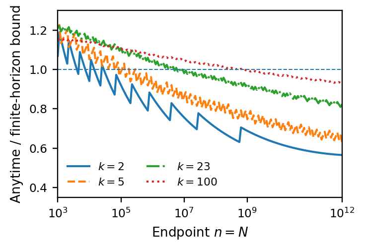
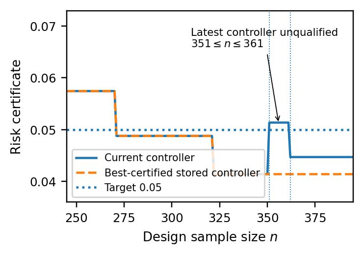
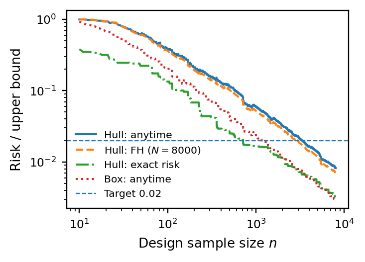

# Numerical results

This package generates numerical results for the paper **A Universal Iterated-Logarithm Anytime Law for Data-Driven Control Design**, by **G. Calafiore**.

Tables below are recomputed from this workspace. The numerical verification scripts separately check the printed values.

## Table 2: certificate comparisons

| $k$ | Beta | CG23 | FH | Any | Any/FH |
| --- | --- | --- | --- | --- | --- |
| 2 | 4.74 | 8.85 | 23.25 | 21.38 | 0.920 |
| 5 | 9.15 | 14.08 | 30.16 | 29.78 | 0.987 |
| 23 | 31.41 | 39.81 | 61.91 | 68.63 | 1.109 |
| 100 | 116.99 | 133.73 | 168.67 | 187.03 | 1.109 |
| 1000 | 1052.29 | 1109.39 | 1196.10 | 1267.44 | 1.060 |

## Table 3: first-target stopping

| Method | Mean n | Errors | Error probability (%) |
| --- | --- | --- | --- |
| Fixed N | 93.0 | 372 | 3.72 [3.36, 4.11] |
| CG23-repeated | 165.5 | 10 | 0.10 [0.048, 0.184] |
| GCC--T4 | 156.2 | 21 | 0.21 [0.130, 0.321] |
| FH, N=800 | 335.0 | 0 | 0 [0, 0.0369] |
| Summable CG23 | 401.9 | 0 | 0 [0, 0.0369] |
| Anytime | 344.1 | 0 | 0 [0, 0.0369] |

## Table 4: continued inspection

| Bound | Through 800 | Through 8000 |
| --- | --- | --- |
| CG23 | 488 | 680 |
| FH, N=8000 | 0 | 0 |
| Summable CG23 | 0 | 0 |
| Anytime | 0 | 0 |

## Figure 1: horizon comparison

## Figure 2: certified archive

## Figure 3: disturbance geometry

## Interpretation

The mechanical candidate bound remains conditional on almost-sure support reconstruction. Its validation counts contraction/LMI violations. The aligned and alternative performance evaluators retain their source definitions; the alternative comparison is exploratory. These runs use the original certificate, without the persistence-window minimum.
